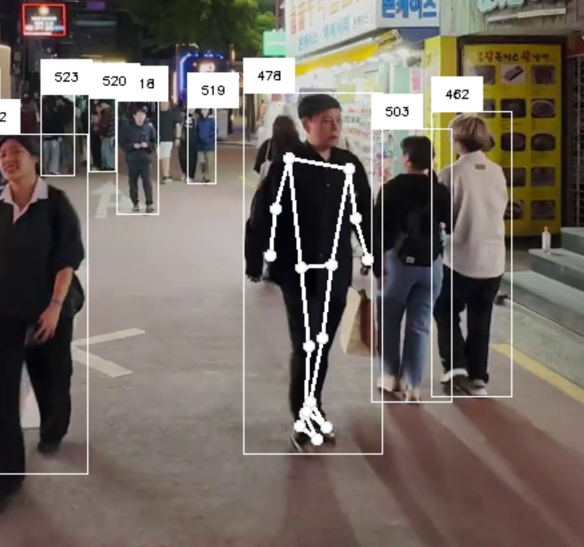

# Real-time People Tracker 'Surveillance' Demo



## 🚀 Quick Start

**To use your webcam for this demo:**

1. Copy the example configuration file:
   ```bash
   cp example-config.toml config.toml
   ```

2. Edit `config.toml` and change the stream source from "rtsp" to "webcam":
   ```toml
   stream_source = "webcam"  # Change from "rtsp" to "webcam"
   ```

3. Install dependencies and run the demo (see [Installation](#installation) below)

---

This project is a real-time person tracking demonstration built for conference and educational settings. It uses a YOLO (You Only Look Once) model to identify and track individuals in a live video stream, showcasing the capabilities of modern computer vision in a transparent and responsible manner.

The primary goal of this interactive demo is to engage attendees and raise awareness about data privacy in an era of increasingly powerful surveillance technologies.

---

## How It Works

The application captures a live video stream (RTSP, webcam, or video file) and processes it frame by frame to:

1.  **Detect and Track Individuals**: It runs a YOLO object detection model to identify people in the video feed.
2.  **Assign Anonymous IDs**: Each detected person is assigned a temporary, anonymous tracking ID that persists as long as they are in the frame.
3.  **Display Live Feed**: The processed video, complete with bounding boxes and anonymous IDs, is displayed in a full-screen window.
4.  **Overlay Informational Graphics**: A logo and QR code are displayed on the video. Most importantly, a prominent, animated message at the top of the screen continuously informs participants that the demonstration is for illustrative purposes only.

---

## Key Features

* **Real-Time Performance**: Utilizes the `ultralytics` YOLO library for efficient, real-time object detection and tracking.
* **Privacy-First Design**: The system is explicitly designed **not to save any personal data**. A clear on-screen disclaimer runs at all times to ensure informed consent from anyone in view.
* **Interactive Controls**: Allows for on-the-fly interaction to demonstrate the system's capabilities.
* **Informational Overlays**: Displays a company logo, a QR code for more information, and dynamic text to inform viewers about the demo's purpose.
* **Modular Architecture**: Clean separation of concerns with each component in its own module for better maintainability and debugging.

---

## Privacy and Consent

This demonstration is fundamentally a tool for education and awareness. It operates on a principle of full transparency and consent.

**No data is retained, stored, or shared.**

All tracking is performed in real-time, and the session data is discarded the moment the application is closed. The prominent on-screen notifications are a core feature, ensuring that anyone within the camera's view is aware of the technology, its function, and its limitations in this context.

---

## Controls

The application can be controlled using the following keyboard commands while the video window is active:

* **Quit**: Press `q` or `esc` to close the application and end the video stream.
* **Pause/Resume Video**: Press `space` to pause or resume video playback (only available when using video files as the source).

---

## Installation

### Dependencies

Using a python virtual environment manager of your choice (in this example we will use conda), install the pre-reqs from requirements.txt

```
conda create -n conference_demo python=3.9.6

conda activate conference_demo

# Navigate to the repo

python -m pip install -r .\requirements.txt

# If it fails, specifically with "encode() argument 'encoding' must be str", run the pip install a second time
```

**Note**: If you encounter issues installing the `dlib` library (required for the face swap feature), the easiest way to resolve this is by using conda:

```bash
conda install conda-forge::dlib
```

**Important**: The `dlib` library is difficult to install with pip/venv. If you're using a virtual environment (venv), you'll need to install dlib separately using conda even within your venv, or switch to using conda for the entire environment.

Alternatively (without face swap feature):

```
# Navigate to the repo
python3 -m venv .venv
source .venv/bin/activate
pip install -r ./requirements.txt
```

### Configuration

The application uses a TOML configuration file. You must copy the example configuration and modify it for your setup:

```bash
cp example-config.toml config.toml
```

**Optional**: If you want to use the face swap feature, download the required model from [here](https://huggingface.co/spaces/asdasdasdasd/Face-forgery-detection/blob/ccfc24642e0210d4d885bc7b3dbc9a68ed948ad6/shape_predictor_68_face_landmarks.dat) and place it in the `models/` directory as `shape_predictor_68_face_landmarks.dat`.

Then edit `config.toml` to configure your video source:

- **For webcam**: Set `stream_source = "webcam"`
- **For RTSP stream**: Set `stream_source = "rtsp"` and configure `rtsp_url`
- **For video file**: Set `stream_source = "video"` and configure `video_path`

```toml
# Example configuration for webcam usage
stream_source = "webcam"  # Options: "webcam", "rtsp", "video"
webcam_id = 0             # Camera device ID (usually 0 for built-in webcam)
```

---

## Running the Application

Run the application using the launcher script:

```bash
python run.py
```

This provides proper error handling and ensures all dependencies are correctly loaded.

---

## Project Structure

The application is organized into a modular structure for better maintainability:

```
surveillance-demo/
├── src/                          # Modular source code
│   ├── __init__.py              # Package initialization
│   ├── main.py                  # Main application entry point
│   ├── app_config.py            # AppConfig dataclass
│   ├── video_source.py          # VideoSource class
│   ├── model_manager.py         # ModelManager class
│   ├── ui_manager.py            # UIManager class
│   ├── effect_processor.py      # EffectProcessor classes
│   ├── gesture_recognizer.py    # GestureRecognizer class
│   ├── thread_manager.py        # ThreadManager class
│   ├── surveillance_demo.py     # Main SurveillanceDemo class
│   └── modules/                 # Additional modules
│       ├── __init__.py          # Modules package
│       ├── drawing_manager.py   # Drawing utilities
│       ├── effects_manager.py   # Effects management
│       ├── frame_processor.py   # Frame processing
│       ├── input_handler.py     # Input handling
│       └── ui_renderer.py       # UI rendering
├── models/                       # Model files directory
├── img/                          # Image assets
├── vid/                          # Video files
├── tools/                        # Utility scripts
├── deprecated/                   # Legacy code
├── run.py                        # Application launcher script
├── requirements.txt              # Python dependencies
├── example-config.toml          # Example configuration
└── README.md                    # This file
```

### Class Responsibilities

- **AppConfig**: Handles configuration loading and management
- **VideoSource**: Manages video input from different sources (RTSP, Webcam, Video)
- **ModelManager**: Handles YOLO and MediaPipe model initialization
- **UIManager**: Manages UI elements, checkboxes, and user interactions
- **EffectProcessor**: Abstract base for video effects (ASCII, Face Swap, Face Blackout)
- **GestureRecognizer**: Handles hand gesture detection and interpretation
- **ThreadManager**: Manages threading for concurrent processing
- **SurveillanceDemo**: Main orchestrator that coordinates all components
- **EffectsManager**: Manages the application of various visual effects
- **FrameProcessor**: Handles the main frame processing loop
- **DrawingManager**: Manages drawing operations and overlays
- **InputHandler**: Processes user input and interactions
- **UIRenderer**: Handles UI rendering and display

### Benefits of the Modular Structure

1. **Separation of Concerns**: Each class has its own file with clear responsibilities
2. **Easier Debugging**: You can focus on specific components
3. **Better Testing**: Individual components can be tested in isolation
4. **Maintainability**: Changes to one component don't affect others
5. **Reusability**: Components can be reused in other projects
6. **Readability**: Smaller files are easier to understand

---

## Development

With this modular structure, you can now:

- **Add new effects** by extending `EffectProcessor`
- **Add new gesture types** in `GestureRecognizer`
- **Modify UI elements** independently in `UIManager`
- **Add new video sources** in `VideoSource`
- **Test individual components** in isolation
- **Debug specific functionality** more easily

The modular version provides the same functionality as the original but with better organization and maintainability.
